```mermaid
graph TB
    subgraph "Client Layer"
        WEB[🌐 Web Browser<br/>localhost:3000]
        CLAUDE[🤖 Claude Desktop<br/>MCP Client]
        CLI[⌨️ CLI Tools<br/>npm commands]
    end

    subgraph "Application Layer"
        WEBSERVER[🖥️ Web Server<br/>Express.js<br/>Port 3000]
        MCP[📡 MCP Server<br/>index.js<br/>stdio protocol]
        CLITOOLS[🛠️ CLI Tools<br/>indexer, analytics,<br/>cache manager]
    end

    subgraph "Service Layer"
        DOCSERVICE[📚 Documentation Service<br/>- Fetch & Parse HTML<br/>- Content Extraction<br/>- Sitemap Processing]
        AISERVICE[🧠 AI Service<br/>- LLM Integration<br/>- Prompt Management<br/>- Response Formatting]
        VECTORSERVICE[🔍 Vector Service<br/>- Embedding Generation<br/>- Semantic Search<br/>- Similarity Ranking]
        CACHESERVICE[💾 Cache Service<br/>- SQLite Operations<br/>- Page Management<br/>- Lock Handling]
    end

    subgraph "Storage Layer"
        SQLITE[(🗄️ SQLite Database<br/>page-cache.db<br/>- Pages Table<br/>- Locks Table)]
        VECTORS[(📊 Vector Index<br/>vectra/index.json<br/>- Embeddings<br/>- Metadata)]
        HTMLCACHE[📁 HTML Cache<br/>data/html/<br/>cached pages]
    end

    subgraph "External Services"
        OLLAMA[🦙 Ollama<br/>Local LLMs<br/>localhost:11434]
        OPENAI[🌐 OpenAI API<br/>GPT Models<br/>Embeddings]
        ANTHROPIC[🔷 Anthropic API<br/>Claude Models]
        DOCS[📖 Documentation Sites<br/>- docs.k3s.io<br/>- ranchermanager.docs<br/>- documentation.suse.com<br/>- etc.]
    end

    %% Client connections
    WEB -->|HTTP/REST API| WEBSERVER
    CLAUDE -->|stdio/MCP| MCP
    CLI -->|Node.js| CLITOOLS

    %% Application layer connections
    WEBSERVER -->|Use Services| DOCSERVICE
    WEBSERVER -->|Use Services| AISERVICE
    WEBSERVER -->|Use Services| VECTORSERVICE
    MCP -->|Use Services| DOCSERVICE
    MCP -->|Use Services| AISERVICE
    MCP -->|Use Services| VECTORSERVICE
    CLITOOLS -->|Use Services| DOCSERVICE
    CLITOOLS -->|Use Services| CACHESERVICE

    %% Service layer connections
    DOCSERVICE -->|Read/Write| CACHESERVICE
    DOCSERVICE -->|Fetch| DOCS
    DOCSERVICE -->|Store HTML| HTMLCACHE
    AISERVICE -->|Query LLM| OLLAMA
    AISERVICE -->|Query LLM| OPENAI
    AISERVICE -->|Query LLM| ANTHROPIC
    VECTORSERVICE -->|Generate Embeddings| OLLAMA
    VECTORSERVICE -->|Generate Embeddings| OPENAI
    VECTORSERVICE -->|Read/Write| VECTORS
    CACHESERVICE -->|SQL Operations| SQLITE

    %% Styling
    classDef clientStyle fill:#e1f5ff,stroke:#01579b,stroke-width:2px
    classDef appStyle fill:#f3e5f5,stroke:#4a148c,stroke-width:2px
    classDef serviceStyle fill:#e8f5e9,stroke:#1b5e20,stroke-width:2px
    classDef storageStyle fill:#fff3e0,stroke:#e65100,stroke-width:2px
    classDef externalStyle fill:#fce4ec,stroke:#880e4f,stroke-width:2px

    class WEB,CLAUDE,CLI clientStyle
    class WEBSERVER,MCP,CLITOOLS appStyle
    class DOCSERVICE,AISERVICE,VECTORSERVICE,CACHESERVICE serviceStyle
    class SQLITE,VECTORS,HTMLCACHE storageStyle
    class OLLAMA,OPENAI,ANTHROPIC,DOCS externalStyle
```

# Docs Navigator MCP - SUSE Edition


An **AI-powered documentation navigator** built as a Model Context Protocol (MCP) server that enables intelligent search, summarization, and exploration of SUSE, Rancher, K3s, RKE2, Longhorn, Harvester, NeuVector, and Kubewarden documentation using **open-source AI models**.

✨ **New:** Production-ready with SQLite caching, advanced analytics, concurrent indexing support, and organized codebase!

🎨 **[View Live Demo](https://mso-docs.github.io/Docs-Navigator-MCP-SUSE-Edition/)** - Check out the modern UI on GitHub Pages!

## 📚 Documentation

- [Architecture Overview](docs/ARCHITECTURE.md) - System design and components
- [Installation Guide](docs/INSTALL.md) - Detailed setup instructions
- [Documentation Sources](docs/SOURCES.md) - All available sources and usage guide
- [Indexing Guide](docs/INDEXING_GUIDE.md) - Understanding caching vs indexing ⭐
- [Quick Reference](docs/QUICKREF.md) - Command reference
- [Usage Examples](docs/EXAMPLES.md) - Common usage patterns
- [Web GUI Guide](docs/WEB_GUI.md) - Web interface documentation
- [MCP Client Setup](docs/MCP_CLIENT_CONFIG.md) - Configure MCP clients
- [SQLite Migration Guide](docs/SQLITE_MIGRATION.md) - SQLite caching details
- [GitHub Pages Deployment](docs/GITHUB_PAGES.md) - Deploy UI showcase to GitHub Pages
- [Contributing](docs/CONTRIBUTING.md) - Contribution guidelines

## 🌟 Features

### Core Capabilities
- 🌐 **Web GUI** - Beautiful localhost web interface for easy access
- 🔍 **Semantic Documentation Search** - Find relevant docs using natural language queries
- 🤖 **Local Open-Source AI** - Powered by Ollama (Llama, Mistral, etc.) - no API keys required
- 📚 **Multi-Source Support** - Navigate SUSE, Rancher, K3s, RKE2, Longhorn, Harvester, NeuVector, Kubewarden documentation
- 💬 **Conversational Interface** - Ask questions and get answers with source citations
- 📝 **Smart Summarization** - Generate concise or detailed summaries of documentation
- 🔌 **MCP Protocol** - Integrates with Claude Desktop and other MCP-compatible clients
- ⚡ **Vector Search** - Fast semantic retrieval using embeddings
- 🎯 **Flexible AI Providers** - Support for Ollama (local), OpenAI, or Anthropic

### Production Features (NEW!)

- 💾 **SQLite Caching** - Efficient page caching with SQLite for scaling to 1000s of documents
- 📊 **Analytics Reports** - Comprehensive cache analytics and health monitoring
- 🔍 **Advanced Queries** - Filter cached documents by source, status, date range
- 🔒 **Concurrent Indexing** - Safe multi-process indexing with automatic locking
- 📈 **Cache Management** - Validate, clear, rebuild, and optimize caches
- 🎯 **Smart Indexing** - Conditional GET requests, ETag/Last-Modified support, content hash detection
- 📦 **Organized Codebase** - Clean directory structure with CLI/services/tests/utils separation

## 🏗️ Architecture



### Key Components

- **Web GUI**: Modern React-like interface for interactive documentation search
- **MCP Server**: Model Context Protocol implementation for Claude Desktop integration
- **CLI Tools**: Command-line utilities for indexing, analytics, and cache management
- **Documentation Service**: Handles fetching, parsing, and caching of documentation pages
- **AI Service**: Manages LLM interactions with support for multiple providers (Ollama, OpenAI, Anthropic)
- **Vector Service**: Generates embeddings and performs semantic search using Vectra
- **Cache Service**: SQLite-based caching system with locking for concurrent operations

## 🆕 Recent Updates (December 2025)

### Phase 3: Production-Ready SQLite Migration

**What's New:**

1. **SQLite Caching System**
   - Migrated from JSON to SQLite for better scalability
   - Support for 1000s of documents without performance degradation
   - Automatic schema creation with indexes on source, status, timestamps
   - Backward compatible - can revert to JSON with `USE_JSON_CACHE=true`

2. **Advanced Analytics & Queries**
   - `npm run analytics` - Comprehensive cache health reports
   - `npm run query-cache` - Filter by source, status, date range
   - Cache efficiency metrics, stale page detection, automated recommendations
   - By-source breakdowns showing indexed/total ratios

3. **Concurrent Indexing Safety**
   - Table-based locking prevents race conditions
   - 30-minute lock timeout with automatic expiration
   - `npm run clear-locks` for manual lock cleanup
   - Safe to run multiple indexing processes simultaneously

4. **Organized Codebase**
   - Clean directory structure: `cli/`, `services/`, `tests/`, `utils/`
   - 15 files reorganized from root into logical folders
   - Better maintainability and developer experience
   - Comprehensive documentation in `src/README.md`

5. **Performance Optimizations**
   - Smart caching with ETag/Last-Modified support
   - Content hash detection skips unchanged documents
   - Sitemap optimization pre-filters URLs before fetching
   - Conditional GET requests reduce unnecessary downloads

**Migration:**
- Existing users: Run `npm run migrate-sqlite` to convert JSON cache
- New users: SQLite is default, no action needed
- See [docs/SQLITE_MIGRATION.md](docs/SQLITE_MIGRATION.md) for details

## 🚀 Quick Start

### Prerequisites

- **Node.js 18+** - [Download here](https://nodejs.org/)
- **Ollama** (for local AI) - [Download here](https://ollama.ai)
- **OpenAI API Key** (optional) - For production embeddings

### Step 1: Install Dependencies

```bash
# Clone the repository
git clone https://github.com/mso-docs/Docs-Navigator-MCP-SUSE-Edition.git
cd Docs-Navigator-MCP-SUSE-Edition

# Install Node.js dependencies
npm install
```

### Step 2: Install AI Models

**Option A: Local AI with Ollama (Free, Recommended for Q&A)**

```bash
# Install Ollama from https://ollama.ai

# Pull required models
ollama pull llama3.2:latest       # For answering questions
ollama pull nomic-embed-text      # For embeddings (alternative)

# Verify Ollama is running
ollama list
```

**Option B: OpenAI (Recommended for Embeddings)**

```bash
# Get API key from https://platform.openai.com/api-keys
# Add to .env file: OPENAI_API_KEY=your_key_here
```

**Hybrid Approach (Best Performance):**
- Use OpenAI for embeddings (fast, reliable)
- Use Ollama for Q&A (free, private)

### Step 3: Configure Environment

```bash
# Copy example environment file
cp .env.example .env

# Edit .env with your settings
nano .env  # or use your favorite editor
```

**Essential Configuration:**

```env
# For Ollama-only setup
AI_PROVIDER=ollama
EMBEDDING_PROVIDER=ollama
OLLAMA_MODEL=llama3.2:latest
EMBEDDING_MODEL=nomic-embed-text

# For OpenAI embeddings + Ollama Q&A (Recommended)
AI_PROVIDER=ollama
EMBEDDING_PROVIDER=openai
OPENAI_API_KEY=sk-your-key-here
OLLAMA_MODEL=llama3.2:latest

# Cache settings (SQLite is default)
PAGE_CACHE_PATH=./data/page-cache.db
EMBEDDING_CACHE_PATH=./data/embedding-cache.json
```

### Step 4: Index Documentation

```bash
# Index all documentation sources (SUSE, Rancher, K3s)
npm run index all

# Or index individual sources
npm run index k3s
npm run index rancher
npm run index suse
```

**First-time indexing takes 5-15 minutes** depending on your internet speed and AI provider. Subsequent runs are much faster due to caching.

### Step 5: Start Using!

**Web Interface (Easiest):**

```bash
npm run web
```

Then open <http://localhost:3000> in your browser.

**MCP Server (for Claude Desktop):**

```bash
npm start
```

See [docs/MCP_CLIENT_CONFIG.md](docs/MCP_CLIENT_CONFIG.md) for Claude Desktop setup.

### 🎉 You're Ready!

Try asking questions like:
- "How do I install K3s on SUSE?"
- "What are the differences between K3s and RKE2?"
- "Show me Rancher backup procedures"

See [docs/EXAMPLES.md](docs/EXAMPLES.md) for more usage examples.

## 🛠️ Available Tools

The MCP server provides these tools:

### `search_docs`
Search documentation using semantic search.
```json
{
  "query": "How do I install K3s on SUSE?",
  "source": "all",
  "limit": 5
}
```

### `ask_question`
Ask questions about documentation and get AI-generated answers with sources.
```json
{
  "question": "What are the differences between K3s and RKE2?",
  "context": "deployment on SUSE Linux Enterprise"
}
```

### `summarize_doc`
Generate AI summaries of documentation pages.
```json
{
  "url": "https://docs.k3s.io/installation",
  "format": "bullet-points"
}
```

### `get_doc_section`
Retrieve specific documentation content.
```json
{
  "url": "https://documentation.suse.com/sles/15-SP5/"
}
```

### `index_documentation`
Index documentation for faster searching.
```json
{
  "source": "k3s",
  "forceRefresh": false
}
```

### `list_doc_sources`
View all available documentation sources and their status.

## 📖 Usage Examples

### Web Interface (Easiest!)

Start the web interface and access it from your browser:

```bash
npm run web
```

Then open **http://localhost:3000** in your browser. See [docs/WEB_GUI.md](docs/WEB_GUI.md) for details.

### With Claude Desktop

1. Configure Claude Desktop (see [docs/INSTALL.md](docs/INSTALL.md))
2. Ask Claude to use the tools:

```
"Can you search the SUSE documentation for information about container security?"

"Use the docs navigator to find K3s installation instructions"

"Summarize the Rancher high availability setup documentation"
```

### Direct MCP Usage

```bash
# Start the MCP server
npm start

# The server communicates via stdio using MCP protocol
```

### Command-Line Tools

```bash
# Indexing
npm run index [source]      # Index documentation (k3s, rancher, suse, all)
npm run index all           # Index all sources
npm run index k3s --force   # Force refresh (ignore cache)

# Cache Management
npm run stats               # Show cache statistics
npm run analytics           # Comprehensive analytics report
npm run query-cache [opts]  # Query cache with filters
npm run clear-cache         # Clear all caches
npm run validate            # Validate cache integrity
npm run clear-locks         # Clear expired indexing locks

# Utilities
npm run fix-sources         # Fix legacy cache entries
npm run mark-indexed        # Mark documents as indexed
npm run migrate-sqlite      # Migrate JSON cache to SQLite

# Testing
npm test                    # Run test suite
```

## 🏗️ Architecture

```text
┌─────────────────────────────────────────────────────────────┐
│                     User Interfaces                          │
├─────────────────┬─────────────────┬──────────────────────────┤
│   Web Browser   │  Claude Desktop │   Direct MCP Client      │
│  (port 3000)    │   (MCP stdio)   │     (stdio/JSON)         │
└────────┬────────┴────────┬────────┴────────┬─────────────────┘
         │                 │                 │
         ▼                 ▼                 ▼
┌─────────────────────────────────────────────────────────────┐
│              Application Layer (Node.js)                     │
├─────────────────┬───────────────────────┬───────────────────┤
│  web-server.js  │     index.js (MCP)    │   CLI Tools       │
│   (Express)     │    (stdio protocol)   │  (index-docs.js)  │
└────────┬────────┴───────────┬───────────┴────────┬──────────┘
         │                    │                    │
         └────────────────────┼────────────────────┘
                              ▼
┌─────────────────────────────────────────────────────────────┐
│                   Service Layer                              │
├──────────────────┬──────────────────┬──────────────────────┤
│  AI Service      │  Vector Service  │  Doc Service         │
│  - Ollama Q&A    │  - Vectra DB     │  - HTTP fetching     │
│  - OpenAI embed  │  - Embeddings    │  - HTML parsing      │
│  - Summarization │  - Similarity    │  - Cache management  │
└────────┬─────────┴────────┬─────────┴──────────┬───────────┘
         │                  │                    │
         ▼                  ▼                    ▼
┌─────────────────────────────────────────────────────────────┐
│                      Data Layer                              │
├───────────────┬─────────────────┬────────────────────────────┤
│ SQLite Cache  │  Vectra Vectors │  Embedding Cache (JSON)   │
│ - Page cache  │  - Doc chunks   │  - Text hash → vector     │
│ - Metadata    │  - Embeddings   │  - Fast deduplication     │
└───────────────┴─────────────────┴────────────────────────────┘
```

### Key Components

- **MCP Server** (`index.js`): Implements Model Context Protocol for tool execution via stdio
- **Web Server** (`web-server.js`): Express server providing browser-based UI
- **AI Service**: Handles LLM interactions for Q&A and summarization (Ollama/OpenAI/Anthropic)
- **Cache Service**: SQLite-based page caching with advanced queries and analytics
- **Vector Service**: Manages semantic search using Vectra vector database
- **Documentation Service**: Fetches, parses, and indexes documentation with smart caching

### Data Flow

1. **Indexing**: Docs → Fetch → Parse → Chunk → Embed → Store in Vectra + Cache
2. **Searching**: Query → Embed → Vector Search → Retrieve Docs → Return Results
3. **Q&A**: Question → Context Search → LLM → Answer with Citations

## 🔧 Configuration

Edit `.env` to configure:

```env
# AI Provider (ollama, openai, anthropic)
AI_PROVIDER=ollama

# Ollama Settings
OLLAMA_BASE_URL=http://localhost:11434
OLLAMA_MODEL=llama3.2:latest
EMBEDDING_MODEL=nomic-embed-text

# Documentation Sources
SUSE_DOCS_BASE_URL=https://documentation.suse.com
RANCHER_DOCS_URL=https://ranchermanager.docs.rancher.com
K3S_DOCS_URL=https://docs.k3s.io

# Vector Database
VECTOR_DB_PATH=./data/vectors
```

## 📁 Project Structure

```text
Docs-Navigator-MCP-SUSE-Edition/
├── docs/              # Documentation files
│   ├── ARCHITECTURE.md         # System design and components
│   ├── INSTALL.md              # Detailed installation guide
│   ├── QUICKREF.md             # Command quick reference
│   ├── EXAMPLES.md             # Usage examples
│   ├── WEB_GUI.md              # Web interface guide
│   ├── MCP_CLIENT_CONFIG.md    # MCP client configuration
│   ├── SQLITE_MIGRATION.md     # SQLite caching guide
│   └── CONTRIBUTING.md         # Contribution guidelines
│
├── scripts/           # Setup and utility scripts
│   ├── setup.sh       # Linux/macOS setup script
│   └── setup.bat      # Windows setup script
│
├── src/               # Source code (organized by purpose)
│   ├── cli/           # Command-line tools
│   │   ├── index-docs.js       # Main indexing CLI
│   │   ├── cache-analytics.js  # Analytics reports
│   │   ├── query-cache.js      # Cache queries
│   │   └── clear-locks.js      # Lock management
│   │
│   ├── services/      # Core business logic
│   │   ├── ai-service.js           # AI/LLM integration
│   │   ├── cache-service.js        # SQLite cache management
│   │   ├── documentation-service.js # Doc fetching & parsing
│   │   └── vector-service.js       # Vector database ops
│   │
│   ├── tests/         # Test scripts
│   │   ├── test.js                 # Main test suite
│   │   ├── test-cache.js           # Cache tests
│   │   ├── test-concurrent-locks.js # Lock tests
│   │   └── test-ollama.js          # Ollama integration tests
│   │
│   ├── utils/         # Maintenance utilities
│   │   ├── migrate-to-sqlite.js    # JSON→SQLite migration
│   │   ├── fix-cache-sources.js    # Cache repair tools
│   │   └── mark-indexed.js         # Status updates
│   │
│   ├── index.js       # MCP server entry point
│   └── web-server.js  # Web UI server
│
├── public/            # Web GUI assets (HTML, CSS, JS)
├── data/              # Data storage
│   ├── vectors/       # Vector database (Vectra)
│   ├── page-cache.db  # SQLite page cache
│   ├── embedding-cache.json # Embedding cache
│   └── html/          # Cached HTML files
│
└── .env               # Environment configuration
```

## 🔧 Troubleshooting

### Installation Issues

**Problem: `npm install` fails**

```bash
# Clear npm cache and retry
npm cache clean --force
rm -rf node_modules package-lock.json
npm install
```

**Problem: Node.js version too old**

```bash
# Check version (needs 18+)
node --version

# Update Node.js from https://nodejs.org/
# Or use nvm:
nvm install 18
nvm use 18
```

### Ollama Issues

**Problem: "Connection refused" or "ECONNREFUSED"**

```bash
# Check if Ollama is running
curl http://localhost:11434/api/tags

# Start Ollama
ollama serve

# Or check Ollama is installed
ollama --version
```

**Problem: Models not found**

```bash
# List installed models
ollama list

# Pull required models
ollama pull llama3.2:latest
ollama pull nomic-embed-text

# Verify models work
ollama run llama3.2:latest "Hello"
```

**Problem: Ollama too slow**

```bash
# Use OpenAI for embeddings instead
# Edit .env:
EMBEDDING_PROVIDER=openai
OPENAI_API_KEY=your_key_here

# Keep Ollama for Q&A (free and private)
AI_PROVIDER=ollama
```

### Indexing Issues

**Problem: Indexing fails with "Item already exists"**

```bash
# This happens with parallel indexing - use sequential mode
# In .env file:
FETCH_BATCH_SIZE=1

# Or clear vectors and reindex
npm run clear-cache
npm run index all
```

**Problem: "Another indexing process is already running"**

```bash
# Clear stale locks
npm run clear-locks

# Then retry indexing
npm run index all
```

**Problem: Indexing very slow**

```bash
# Use OpenAI embeddings (much faster than Ollama)
# Edit .env:
EMBEDDING_PROVIDER=openai
OPENAI_API_KEY=your_key_here

# Ollama embeddings take ~30 min for 110 docs
# OpenAI embeddings take ~2 min for same docs
```

**Problem: "404 Not Found" during indexing**

```bash
# Some documentation URLs may have changed
# Check cache analytics for details
npm run analytics

# Rebuild specific source
npm run rebuild suse
```

### Cache Issues

**Problem: UI shows "0 documents indexed"**

```bash
# Check actual cache status
npm run stats

# If cache exists but UI shows 0, restart web server
npm run web

# If genuinely empty, index documentation
npm run index all
```

**Problem: Outdated cached content**

```bash
# Force refresh all caches
npm run index all --force

# Or clear and reindex
npm run clear-cache
npm run index all
```

**Problem: Cache corruption**

```bash
# Validate cache integrity
npm run validate

# If errors found, rebuild
npm run clear-cache
npm run migrate-sqlite  # If migrating from JSON
npm run index all
```

### Web Interface Issues

**Problem: Web server won't start**

```bash
# Check if port 3000 is in use
lsof -i :3000  # Linux/Mac
netstat -ano | findstr :3000  # Windows

# Kill process using port 3000 or change port
# Edit src/web-server.js: const PORT = 3001;
```

**Problem: "No results found" in web UI**

```bash
# Verify documents are indexed
npm run stats

# Check AI service is working
npm test

# Verify Ollama/OpenAI connection
curl http://localhost:11434/api/tags  # Ollama
```

### MCP Server Issues

**Problem: Claude Desktop can't connect**

```bash
# Verify MCP server starts
npm start

# Check Claude Desktop config file location:
# macOS: ~/Library/Application Support/Claude/claude_desktop_config.json
# Windows: %APPDATA%\Claude\claude_desktop_config.json

# Validate config syntax (must be valid JSON)
# See docs/MCP_CLIENT_CONFIG.md for examples
```

**Problem: Tools not appearing in Claude**

```bash
# Restart Claude Desktop completely
# Check server logs for errors
npm start 2>&1 | tee server.log
```

### Performance Issues

**Problem: Slow searches**

```bash
# Check cache stats
npm run analytics

# Ensure documents are indexed
npm run stats

# Try rebuilding vector index
npm run clear-cache vectors
npm run index all
```

**Problem: High memory usage**

```bash
# Reduce batch sizes in .env:
FETCH_BATCH_SIZE=1
EMBEDDING_CONCURRENCY=1

# Or use OpenAI embeddings (more efficient)
EMBEDDING_PROVIDER=openai
```

### Database Issues

**Problem: SQLite database locked**

```bash
# Close all processes accessing database
pkill -f "node src"

# Clear locks
npm run clear-locks

# If persists, delete and rebuild
rm data/page-cache.db
npm run index all
```

**Problem: Want to revert to JSON cache**

```bash
# Edit .env file:
USE_JSON_CACHE=true
PAGE_CACHE_PATH=./data/page-cache.json

# Restart services
npm run web
```

### Getting Help

1. **Check logs**: Look for error messages in terminal output
2. **Run diagnostics**: `npm run stats` and `npm run analytics`
3. **Validate setup**: `npm test` to run test suite
4. **Check documentation**: See `docs/` folder for detailed guides
5. **GitHub Issues**: Report bugs at repository issues page

### Common Error Messages

| Error | Solution |
|-------|----------|
| `ECONNREFUSED` | Ollama not running - start with `ollama serve` |
| `Item already exists` | Use `FETCH_BATCH_SIZE=1` in .env |
| `Lock held by another process` | Run `npm run clear-locks` |
| `No such table: locks` | Normal on first run - table created automatically |
| `404 Not Found` | Documentation URL changed - run `npm run rebuild` |
| `ENOENT: no such file` | Create data directories: `mkdir -p data/{vectors,html}` |

## 🤝 Contributing

Contributions welcome! This project started during **Hack Week 25**.

See [docs/CONTRIBUTING.md](docs/CONTRIBUTING.md) for guidelines.

## 📄 License

See [LICENSE](LICENSE) file for details.

## 🎯 Use Cases

- **DevOps Engineers**: Quickly find deployment and configuration info
- **System Administrators**: Navigate SUSE Linux documentation efficiently
- **Kubernetes Users**: Get instant answers about K3s and Rancher
- **Technical Writers**: Research and cross-reference documentation
- **Support Teams**: Find solutions faster with semantic search

## 🔗 Resources

### Platform & Tools
- [Model Context Protocol](https://modelcontextprotocol.io)
- [Ollama](https://ollama.ai)

### Documentation Sources
- [SUSE Documentation](https://documentation.suse.com)
- [Rancher Documentation](https://ranchermanager.docs.rancher.com)
- [K3s Documentation](https://docs.k3s.io)
- [RKE2 Documentation](https://docs.rke2.io)
- [Longhorn Documentation](https://longhorn.io/docs)
- [Harvester Documentation](https://docs.harvesterhci.io)
- [NeuVector Documentation](https://open-docs.neuvector.com)
- [Kubewarden Documentation](https://docs.kubewarden.io)

---

Built with ❤️ for Hack Week 25
